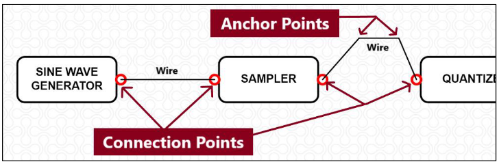
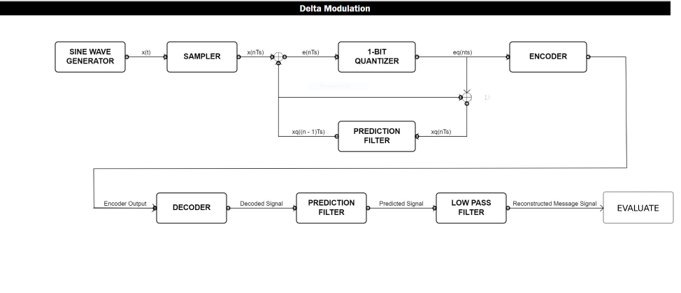
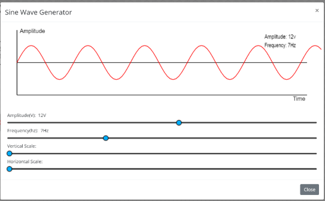
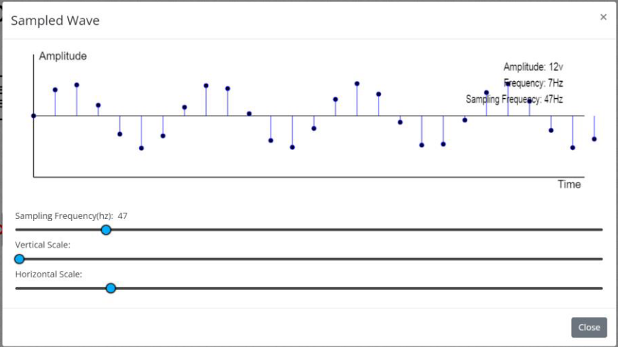
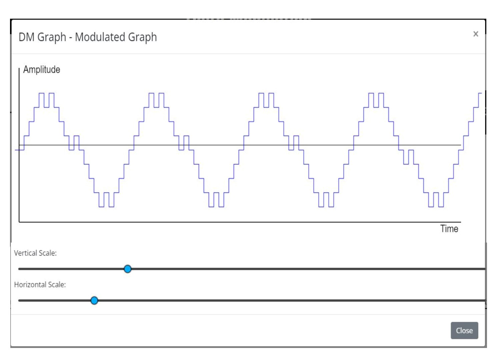
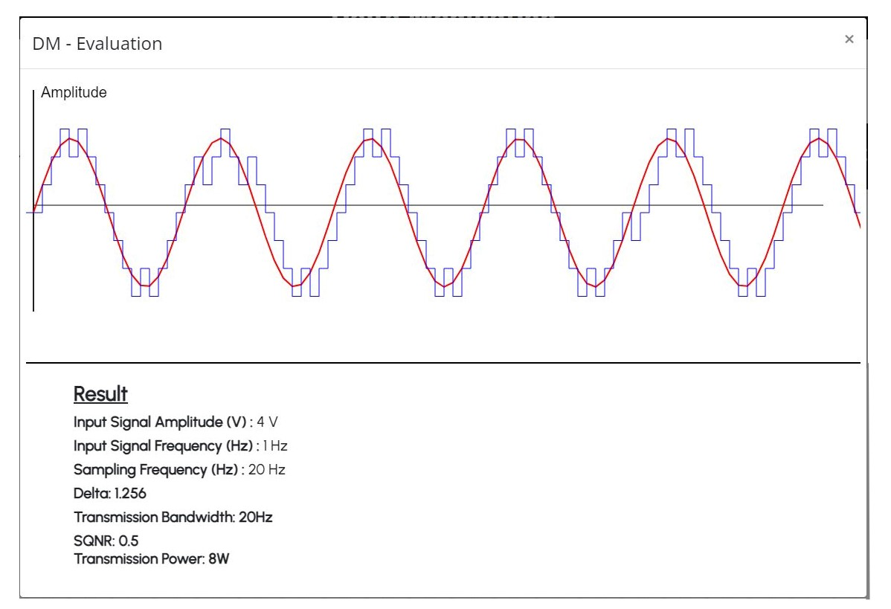
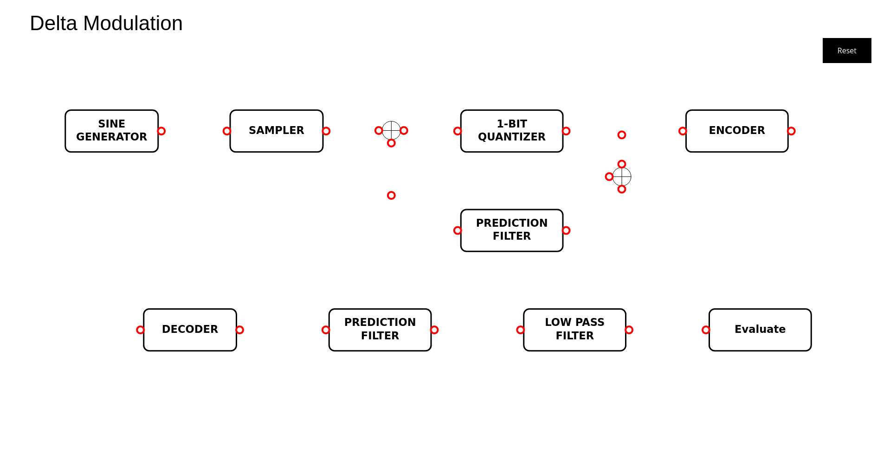
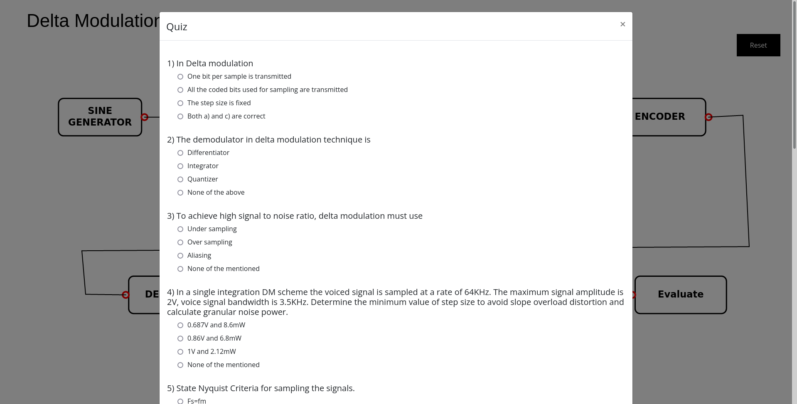
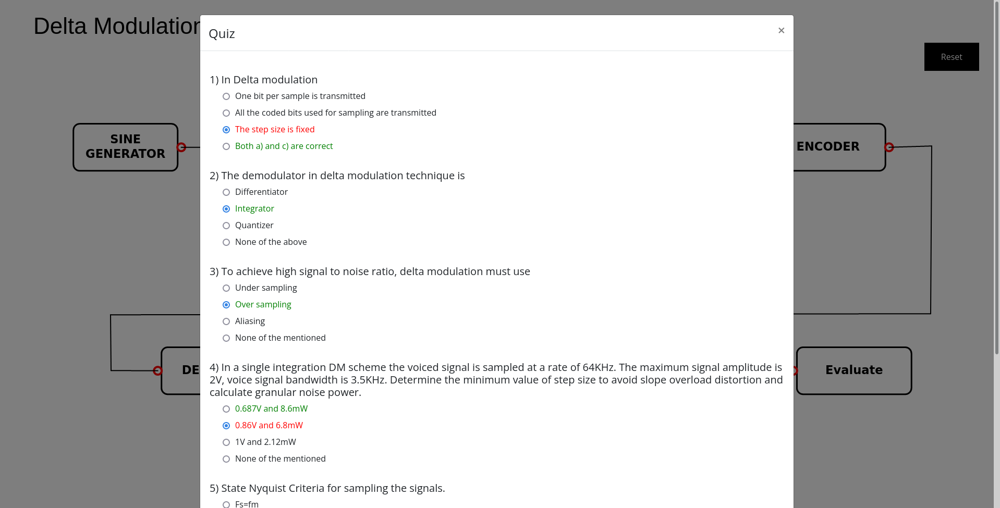

## **Step by Step Procedure to perform experiment**

**Step 1** : The user should Click on the theory under which the concept behind the working of the experiment would be displayed followed by the procedure which would be displayed on the screen, so that the user could perform the DM modulation and demodulation experiment based on the guidelines listed under the procedure.

**Step 2** : The blocks required for the experiment are statically positioned. Click on the output connection point to initiate the wire connection and click on another connection point to complete the connection. Click on any part of the simulation canvas after initiating a wire will the wire be anchored to that point. Connect all the blocks in the right order.

Once all connections are made the workspace should look like this

**Step 3** : Double click the sine wave generator block and set the amplitude and frequency of the input sinusoidal wave.

**Step 4** : Double click the sampler block to set the sampling frequency and to view the sampled wave.

**Step 5** : Double click the encoder to view the DM encoded waveform.

**Step 6** : Double click the DECODER block to observe the decoded PCM wave. This waveform resembles that of the QUANTIZER output.

**Step 7** : Double click the low pass filter to observe the reconstructed message signal.

**Step 8** : Vary the block parameters and observe the values corresponding to the maximum efficiency of the system

To remove a particular wire or undo a wire, select the wire first, the wire gets highlighted and now click on delete button.

The reset button is available at the top right corner of the simulation, so that it clears all the existing connections.

#### Quiz

Quiz dialog box appears once we finish our connections for both modulation and demodulation.

After completing the quiz, click on submit button.

Correct answers are highlighted in green colour and wrong answers are highlighted in red colour.