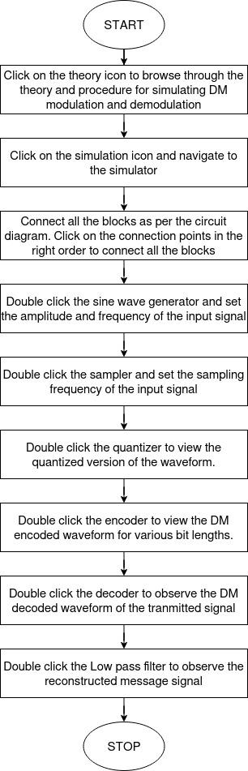
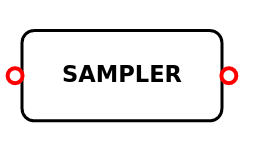
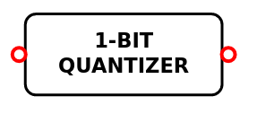
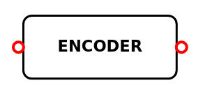

### **Introduction**
The purpose of this experiment is to learn about the Delta modulation (DM) and demodulation principles, as well as how sampled signals are quantized using a 1 bit quantizer to reduce transmission bandwidth and then transmitted. A reconstruction filter is used to recover the baseband signal from the error signal at the receiver portion. This experiment also shows the many sounds that can occur when the amplitude values of a baseband signal are incorrectly chosen, such as slope overload distortion (rapid fluctuating baseband signal) and granular noise (slow varying baseband signal).

### **Equations/formulas**:

| **Theory**     | **Formulae** |   **Description**|
| :-----------: | :------------: | :-----------: |
Sampling rate                                   | fs>2fm                       | fs→sampling rate fm→modulating frequency |
Bandwidth                                      | B=mfs/2                      | m→number of bits fs→sampling rate |
Power (Pmax)                                    | Pmax=∆2/8π2fm2T2 | ∆→step size Tm→sampling time period |
Condition to avoid slope overload distortion    | Am≤∆/2πfmTs           | Am→Amplitude of the message signal |
Signal to Quantization Noise ratio, SQNR        | SQNR=3fs3/8π2fm2W     | W→fs/2 fm→maximum frequency of message signal |

### **Flowchart** :

Fig 1: Flowchart

### **Function of the equipment's  required to perform Pulse Code Modulation/Demodulation for each type.**

### Sine wave generator:
This block is used to generate the sinusoidal input signal of frequency ‘fm’ Hz and amplitude ‘A’ volts.

Fig 2: Sine wave generator

### **Sampler:**
The input analog signal is converted into discrete time signal using a sampler block. The narrow rectangular pulses produced by sampler is used to vary the number of samples in an analog signal. The sampling frequency produced by this block is greater than twice the input analog signal frequency ‘fm’.

Fig 3: Sampler

### **1-bit Quantizer:**
The discrete time signal from the sampler is converted into discrete amplitude signal using quantizer block.

Fig 4: One-Bit quantizer

### **Encoder:**
The discrete time and amplitude signal is converted into digital by encoder block. It produces the ‘1’-bit binary equivalent of the input sample value. The number of bits at the encoder output determines the signal to quantization noise ratio of DM system.

Fig 5: Encoder

### **Decoder:**
The DM wave is converted into quantized PAM using this block. It converts digital data into discrete time- amplitude signal.

Fig 6: Decoder

### **Reconstruction filter:**
Reconstruction filter is the low pass filter with a cut off frequency of ‘fm’ Hz. It allows the analog signal of frequency ‘fm’ and discard all the high frequency components.

Fig 7: Prediction filter to reconstruct signal

### **Evaluate:**
This block is used to analyse the DM parameters such as delta, transmission bandwidth, Signaling rate and signal to quantization noise ratio (SQNR) for the input signal.

Fig 8: Block to display output

### **Advantages of Delta Modulation:**

1) Since, the delta modulation transmits only one bit for one sample, therefore the signaling rate and transmission channel bandwidth is quite small for delta modulation compared to PCM .
2) The transmitter and receiver implementation is very much simple for delta modulation. There is no analog to digital converter required in delta modulation.

### **Disadvantages of Delta Modulation:**

1) Slope overload distortion
2) Granular or idle noise

### **Practical Applications of Amplitude Modulation:**
1) Telephony.
2) Satellite communication system.
